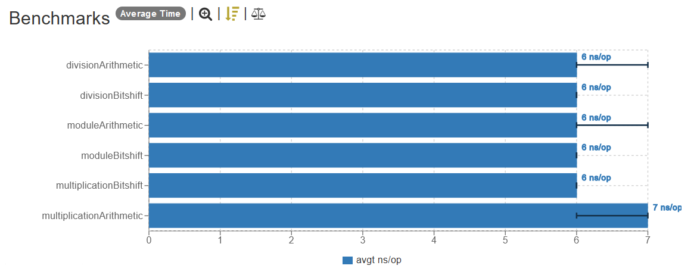

## Bitshift vs Arithmatic Operations

### Introduction

The main objective of this test is to check if there's any real performance difference between performing arithmetic operations and bitshift operations, and if so, how big is this difference.

## Methodology

To test this I've created a JMH benchmark that performs the same operation using both arithmetic and bitshift operations.

I've picked a few prime numbers as `X` to test the different mathematical operations:

| Operation          | Number |
|--------------------|--------|
| Multiplication (*) | 1021   |
| Division (/)       | 16369  |
| Module (%)         | 1031   |

The test relies on RNG with a predefined seed (`1337`) to ensure the results will be consistent between runs, and between different operators. This RNG is used to generate numbers for `Y` in the operations `X * Y`, `X / Y`, and `X % Y`.

### Hardware

The computer utilized to run these tests is a desktop, here are the specs:

| Operation     | Number           |
|---------------|------------------|
| CPU           | AMD Ryzen 7 2700 |
| CPU (cores)   | 8                |
| CPU (threads) | 16               |
| RAM           | 32GB (2x16GB)    |
| GPU           | NVIDIA RTX 3070  |

## Results

#### Linear

_Linear scale (lower is better)._

## Conclusion

In the test, we observed that **there is no observable difference between using arithmetic operations and bitshift operations**. The reason for this is most likely due to the fact that modern CPUs are able to perform these operations in a single cycle, which makes the difference between them negligible or inexistent in most cases.

There's a nice [thread](https://stackoverflow.com/questions/15668718/why-were-bitwise-operations-slightly-faster-than-addition-subtraction-operations) on `StackOverflow` that talks more about this. The most relevant part for us right now is this:

> On most older microprocessors, bitwise operations are slightly faster than addition and subtraction operations and usually significantly faster than multiplication and division operations. On modern architectures, this is not the case: bitwise operations are generally the same speed as addition (though still faster than multiplication).

And we could observe this exact behavior in our results: in our modern hardware, all operations took the exact same time to execute, except for the arithmetic multiplication, which was marginally slower than the other operations (in a negligible way, it only took `1ns` more, which is basically nothing).

Maybe if we used a very old CPU we could observe a difference between arithmetic operations and bitshift operations, but as it currently stands, in modern hardware there's no meaningful difference, as we demonstrated in this test.

## Versions

| Dependency    | Version      |
|---------------|--------------|
| Java          | 21 (Temurin) |
| Kotlin        | 1.9.22       |
| JMH           | 0.7.2        |
