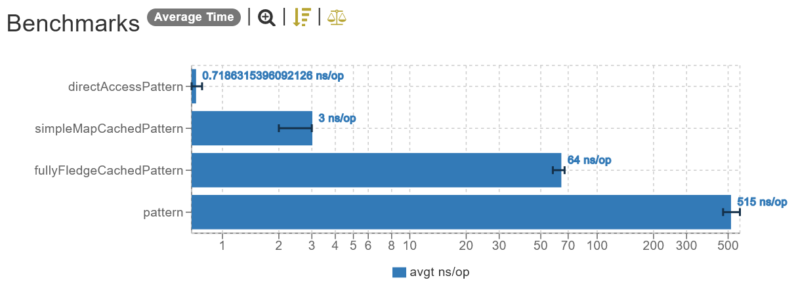

# Pattern and Regex compile time

### Inspiration

I've always heard that compiling a `Pattern` is slow, and caching it is a good idea. But I always wondered if it was _always_ worth to cache it, or only in some circunstances.

For this test, I've chosen a simple (small) pattern to validate date format. This type of pattern was chosen because if it's worth to cache "even" small patterns, then it'll be worth to cache them all.

## Results

_Linear scale (lower is better)._

_Logarithm scale (lower is better)._

## Conclusion

It can be seen that caching even this small pattern brought our time from `~480ns` down to `~65ns` (x12 times faster) when caching it using a fully fledged cache ([Caffeine](https://github.com/ben-manes/caffeine/wiki)), which is ideal in scenarios where concurrency is present and mutability is unavoidable.

If you can give up on either of those, you can substitute the Caffeine `Cache` by a simple `Map`, which will result in another **huge** gain in performance (up to 21 times faster than using the `Cache`), taking only `~3ns`.

And of course, just directly accessing the pattern cached in a class property is by far the fastest option (`< 1ns`).

## Versions

| Dependency | Version         |
|------------|-----------------|
| Java       | 17 (GraalVM EE) |
| Kotlin     | 1.7.21          |
| Caffeine   | 3.1.1           |
