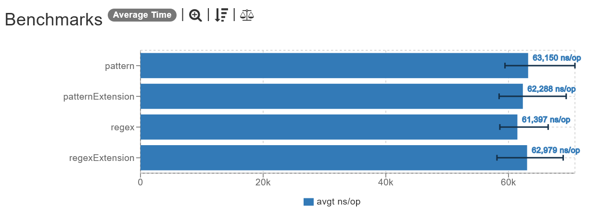

# Pattern and Regex compile time

### Inspiration

I've always heard that compiling a `Pattern` is slow, I just didn't know _how much_ slow it was.

## Test 1: Big Pattern

Let's start addressing the elephant in the room: big patterns. For this test, I've chosen the RFC822 compliant regex pattern for email validation ([source](https://stackoverflow.com/a/13013056/9134906)).

## Results

_Linear scale (lower is better)._

It can be seen that the time to compile the pattern for both Java's `Pattern` and Kotlin's `Regex` is about the same: `~60μs`, which is not an insane time by itself, but can scale pretty quickly if done in a loop.

## Test 2: Small Pattern

How much is `Pattern`/`Regex` compile time affected by the pattern complexity? Let's find out. For this test, I've chosen a simple pattern to validate date format ([source](https://stackoverflow.com/a/22061879/9134906)).

## Results

_Linear scale (lower is better)._

It can be seen that although inarguably the time to compile the regex pattern here is still very slow, for this small pattern it is about `~120 times` faster than the big pattern.

## Conclusion

After looking at the results, it can be concluded that compiling `Pattern` is much slower than simply instantiating a new empty object, and the compile time (which happens at instantiation) is heavily affected by the pattern complexity.

You might be interested in my [other benchmark](../CachePatternStrategies/README.md) where I tested if caching a `Pattern` was worth it, and what is the performance implications of some common caching approaches.

## Versions

| Dependency | Version         |
|------------|-----------------|
| Java       | 17 (GraalVM EE) |
| Kotlin     | 1.7.21          |
