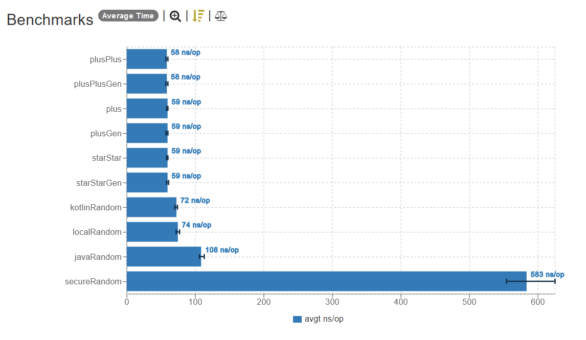
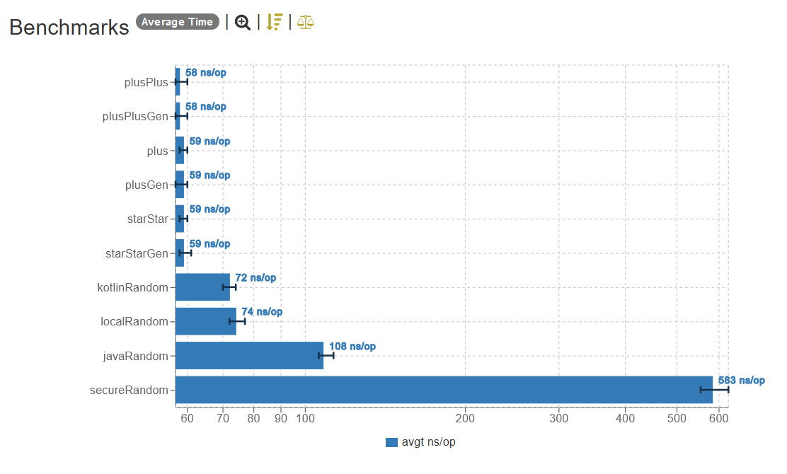

## `Random` performance benchmark

### Introduction

The main objective of this test is to validate the performance of different types of `Random` in Java, see if there is any performance difference between them, and how big is this difference.

## Methodology

First, what is common between the tests: the time to create the instance of each `Random`, and the byte buffer itself is **not** counted in the test.

For the test, I decided to use a `4096` bytes buffer when reading from the `Random`. I choose this value because `4096` is a common value used for buffer size in many difference places. Each iteration lasts `5 seconds`.

## Results

#### Linear

_Linear scale (lower is better)._

#### Logarithm

_Logarithm scale (lower is better)._

## Conclusion

In the test, we can see that apart from the `SecureRandom`, the slowest `Random` implementation by far (due to how it needs to use the CPU entropy to generate the random bytes), and the Java `Random` class, which is the second-slowest implementation, all other implementations are more or less the same speed.

The `fastutil` implementations are the fastest (around `~18%` faster than any Kotlin default implementation), which can be relevant when generating thousands and thousands of random numbers, but otherwise they are not worth to be added on your projects because of this reason, in my opinion.

The main point of `fastutil` randoms is to have an improved, faster implementation of `Random`, but more importantly, have randoms that have a huge [period](https://softwareengineering.stackexchange.com/questions/273105/why-is-the-period-of-a-pseudorandom-number-generator-important), because when generating huge amounts of random data, it is possible to hit the period of the RNG fairly quickly, which can cause the random numbers to start repeating themselves.

## Versions

| Dependency    | Version      |
|---------------|--------------|
| Java          | 21 (Temurin) |
| Kotlin        | 1.9.22       |
| JMH           | 0.7.2        |
| dsiutils      | 2.7.3        |
| fastutil      | 8.5.12       |
| fastutil-core | 8.5.12       |
